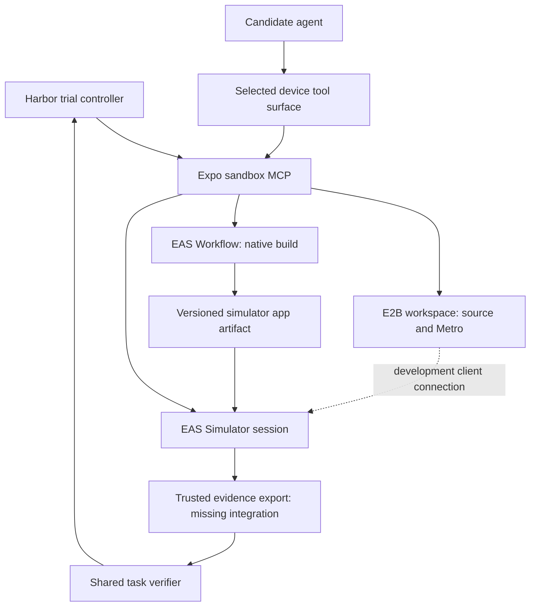

# Local and EAS execution for Expo evaluators

Archived research and proposed design · 2026-09-09

**Superseded:** the external result bridge and upstream re-import tooling were removed.
Use the [repository map](../repository-map.md) and current run guides.
Statements below describe the earlier snapshot; deleted file names are historical references.

**Current decision:** use local simulators and EAS Workflows directly. Expo
Sandbox MCP is an experiment and is excluded from the evaluator implementation.
The cloud workflow runs its own simulator alongside Harbor and the verifier.
See [running mobile evaluations](../running-mobile-evals.md) for current setup.

The remainder is historical research from before that decision. Its discussion
of Geneva, E2B and a possible MCP adapter records alternatives explored, not
runtime dependencies or an accepted implementation roadmap. Source observations
refer to the original snapshots below.

Source snapshots:

- Evaluators: `9abe5a1aa7d8a269cff8eddce1d2a1867da3e045`, this workspace.
- Sandbox MCP: `fae9abc8914ce74a988eabe2b5c65e555dcd3080`, `/Users/adamzvada/conductor/workspaces/expo-sandbox-mcp/geneva`.
- Public EAS documentation and workflow schema retrieved September 9, 2026. Copies used for research are in `.context/eas-research/`.

Statements about existing implementation below come from those snapshots. Proposed interfaces and rollout steps are design recommendations. Prior live observations recorded in Geneva's research documents are identified separately; I did not repeat those experiments.

## 1. Separate the four responsibilities

| Responsibility | Owns | Local execution | Cloud execution |
|---|---|---|---|
| Experiment runner | Task/model/tool combinations, attempts, budgets, aggregation | Harbor on the Mac | Harbor on a controller or a bounded EAS job |
| Workspace | Source edits, shell commands, dependencies, Metro | Per-trial local directory | E2B when using sandbox MCP; another isolated Harbor environment is also possible |
| Native execution | Swift/Xcode builds and device runtime | Xcode and a local iOS Simulator | EAS Workflows for builds; EAS Simulator for a separately controlled device |
| Verification | Trusted evidence collection and task checks | Local collector + shared checks | Cloud collector + the same checks |

**EAS Workflows and EAS Simulator are distinct execution resources.** A macOS workflow can boot a simulator *inside its own worker*. Alternatively, a controller can lease a separate EAS Simulator and drive it remotely. A workflow's `simctl` sees the worker's simulators; it does not automatically address a separately leased EAS Simulator.

This distinction explains the state-access problem and prevents paying for a second device when the workflow-local device already satisfies the task. Callstack's public [agent QA workflow](https://github.com/callstackincubator/eas-agent-device/blob/main/.eas/workflows/agent-qa-mobile.yml) demonstrates the colocated pattern: an iOS custom job on `macos-medium` provisions its simulator and runs an agent against it. Its Android job uses a Linux runner with nested virtualization. The same workflow also demonstrates native fingerprint lookup and repacking before falling back to a build.

## 2. What the evaluator repository already provides

There are three materially different evaluation families:

| Family | What is evaluated | Current verification | What a cloud port needs |
|---|---|---|---|
| `codegen` — 18 tasks | Code produced by an agent | Reference comparison for plumbing; weighted LLM rubric for actual scoring | Cloud coding environment and judge auth; simulator only for an additional runtime lane |
| `simbench` — 7 tasks | Model and device-tool ability on a fixed SwiftUI app | App state plus UI-event journal | Remote provisioning, device control, trusted state export |
| `expo-mobile-eval-import` | Output from an external mobile evaluator | Numeric normalization of `result.json` | A real evaluator producer and artifact retrieval |

The [README](../../README.md) explicitly keeps the EAS bridge outside Harbor core. This is a useful architectural decision to preserve.

The [local environment](../../src/expo_harbor_evals/local_env.py) already materializes `/app`, `/tests`, `/solution`, and `/logs` inside each trial directory. The [Mac variant](../../src/expo_harbor_evals/mac_sandbox_env.py) adds seatbelt write restrictions. Neither provides a separate simulator per trial, and the Mac profile allows unrestricted reads and several shared writable caches. These are development environments, not a strong boundary against a benchmark agent reading solutions or tampering with host-accessible evidence.

Simbench's [setup script](../../tasks/simbench/simbench-ios-07-goldennotes-shift-flow/environment/driver/setup.sh) compiles GoldenNotes with `swiftc`, uninstalls it, and installs a fresh copy. It uses a shared temporary build directory, a default device name, and the global `booted` simulator selector. [Job configs](../../jobs/simbench/flows.yaml) therefore serialize trials. Device selection needs fixing before parallel local execution: checking whether *any* simulator is booted does not establish that the configured device is the one used by installation and verification.

The flow [verifier](../../tasks/simbench/simbench-ios-07-goldennotes-shift-flow/tests/verify.py) already separates most check logic into `build_checks(container, load_json)`. Its machine dependency is primarily `app_container()`, which runs `xcrun simctl get_app_container booted ...`. That is a narrow and promising extraction point.

Two integration gaps are easy to miss:

- **The artifact bridge is only an importer.** `import_eas_eval_artifact.py` (removed) reads a local JSON file, directory, or tarball. It does not submit a workflow, poll it, or download artifacts. `expo-mobile-eval-import/tests/test.sh` (removed) can execute `MOBILE_EVAL_COMMAND`, but defaults to a passing fixture when no real producer is configured.
- **Codegen tasks are not uniformly runnable apps.** Only 6 of 18 task environments contain a root `package.json`; the transparent-header feedback task contains source files and a Dockerfile. A simulator lane must supply a pinned app scaffold, dependencies, routing layout, and launch recipe before it can evaluate these outputs. A package manifest alone would still not prove runtime readiness.

The Mac has Xcode selected and `uv`, `agent-device`, `argent`, `claude`, and `muse` on PATH. Installed `agent-device` reports `0.19.3`. This confirms useful local prerequisites, not that every task currently passes.

## 3. Local mode: preserve the direct development loop

The local path should be:

```text
Harbor trial
  → materialize task workspace
  → select/lease one explicit simulator UDID
  → install fresh golden app or task-specific app
  → run candidate agent with chosen device tool
  → stop candidate activity and collect state + journal
  → run shared verifier
  → save Harbor logs and reward
  → release only this trial's device/processes
```

Keep one concurrent simulator trial initially. Replace `booted` everywhere with a single resolved UDID and put builds and tool session state under the trial root. A lock must cover setup, the agent phase, verification, and cleanup; protecting only installation still allows another trial to reset the app during grading.

The local mode should need no Expo account, E2B account, Convex deployment, or Metro tunnel for GoldenNotes. Ordinary iOS simulation runs on the Mac. On Linux, code-only evaluation remains local, but an iOS runtime requires a remote Mac/device. Label that mixed arrangement as hybrid execution.

For Expo runtime tasks, distinguish:

- A fixed artifact for evaluating the final submitted code.
- A development client plus Metro for an agent that is allowed to edit and inspect continuously.
- Expo Go only for tasks whose native requirements it actually supports.

A release artifact will not acquire edited JS merely because Metro is running. Native fingerprint reuse establishes native compatibility; a static result still needs the submitted JS, via rebuilding or a supported repack operation. Record both native identity and submitted-source identity.

## 4. Two cloud arrangements, with different uses

### A. A simulator inside one EAS macOS job

Run a small Harbor shard in a custom macOS workflow: provision dependencies, boot a simulator, install the fixed app, execute the candidate, collect local app state, verify, and upload trial artifacts.

This is the shortest route to checking whether existing local task semantics survive on EAS. Both `simctl` and the app data container are on the same worker. Start with one task and floor/oracle trials; do not send the full model ladder into one unbounded job.

Local subscription/keychain authentication will not simply appear on a fresh worker. The current `ClaudeHostAgent` and `MuseHostAgent` are explicitly host-authenticated development adapters. Cloud runs need an explicitly supported credential path, controlled agent configuration, and preservation of usage reporting.

For trust, a fresh VM provides separation from other trials, but it does not separate an unrestricted candidate process from the verifier within the same VM. Protect hidden checks, reference solutions, resource credentials, and the app's evidence through process/user or broker boundaries before calling this a hardened benchmark.

Use this arrangement for the first portability proof and potentially for stable batch simbench runs. It uses EAS cloud compute but **does not exercise the separately leased EAS Simulator service**.

### B. EAS Simulator + EAS Workflows + sandbox MCP

This matches the sandbox MVP's architecture and is the recommended cloud integration to pursue after the evidence gate:



The candidate process can run on the controller while its shell and file tools target E2B. Alternatively, it can execute in an isolated environment with remote device tools attached. Avoid assuming that creating an E2B sandbox also creates a Harbor agent integration: mapping exec, file transfer, cancellation, and logs into Harbor remains work.

EAS Workflows handles native compilation or native diagnostics. EAS Simulator hosts the installed app. E2B carries editable code and Metro. A prebuilt GoldenNotes artifact can be shared by content hash; each trial still gets fresh app data. Native compilation should not be repeated for every model attempt unless build behavior itself is under evaluation.

For a fully external run, Harbor can execute on a cloud controller or in an EAS Linux job and delegate the Mac/device operations. Start with Harbor on this Mac controlling remote execution; moving the controller afterward isolates one additional variable. Do not occupy a scarce macOS worker solely to wait for a second macOS build job from the same constrained account.

## 5. What to reuse from Geneva, and what is missing

The following are implemented in the inspected checkout, although they were not exercised live in this research:

| Existing component | Useful evaluator role |
|---|---|
| `create_sandbox`, uploads, file tools, `sandbox_exec` | Materialize the candidate's workspace and execute code in E2B |
| `eas_workflow_run` / `eas_workflow_status` | Submit native shell steps; obtain status, logs, artifact URLs |
| `simulator_start` / status / stop | Lease and release the remote device |
| `simulator_install_artifact` | Install a Swift/Xcode simulator `.app` tarball from a workflow |
| `simulator_install_build` | Install an EAS development or standalone build |
| UI, gesture, screenshot, record, logs tools | Candidate observations/actions and debugging evidence |
| Scoped tokens, quotas, reaper | Bound session authority and recover abandoned resources |

Primary implementation files in Geneva: `convex/mcp/tools.ts`, `convex/eas/workflows.ts`, `convex/eas/simulator.ts`, `convex/eas/bootApp.ts`, `convex/deviceVerbs.ts`, `convex/scopedTokens.ts`, and `convex/reaper.ts`.

The most consequential limitations are specific:

1. **No golden-app data export in the exposed device surface.** `simulator_artifacts` lists provider/daemon artifacts; the code does not establish that it can retrieve `Documents/events.json` and the other app files. `sandbox_read_file` reads E2B, not the simulator VM. Treat evidence export as unproven, rather than equating artifacts with app-container access.
2. **One device controller is hardwired.** `convex/eas/simulator.ts` creates `AGENT_DEVICE` sessions. Although current EAS CLI documents other controller types, Geneva does not yet expose controller selection. Running its MCP tools evaluates that particular tool stack; it does not reproduce the existing Argent condition.
3. **The workflow wrapper is intentionally narrower than EAS.** It emits one custom job from up to 10 base64-encoded step bodies. Each step gets a 900-second timeout, the document budget is 15,000 bytes, and the runner image is `latest`. A flow candidate has a 1,500-second budget today, so one step cannot host the existing full candidate run unchanged.
4. **Artifact handling needs failure semantics.** The wrapper collects `sandbox-artifact/*` with `ignore_error: true` and no unconditional failure condition. Missing artifacts need not fail an otherwise successful workflow, and a failed preceding step can prevent collection. Evaluations need an explicit result manifest, guaranteed best-effort upload on failure, and controller handling of absent artifacts.
5. **Workflow project adoption conflicts with a naïve import path.** The server refuses workflow execution against adopted projects to avoid using their environments. Create a disposable eval-owned project/session with a controlled source payload; do not adopt an app and then assume `eas_workflow_run` will work on it.
6. **Quotas are interactive defaults.** A session allows five builds, five workflows, one concurrent simulator per platform, and a 24-hour sandbox TTL. The user cap is 20 active sandboxes. These are code defaults, not verified current account entitlements or a benchmark scheduler.
7. **Workflow cleanup is incomplete for an eval controller.** A cancellation action exists internally, but the inspected MCP catalog lacks a workflow cancellation tool and the reaper handles sandboxes/devices rather than workflow runs. Track run IDs and add cancellation/reconciliation before unattended sweeps.
8. **Pinned environments need an explicit API.** Geneva invokes `agent-device@latest`, while local runs currently resolve an installed binary. Add approved version/image selection and record resolved device/runtime versions. Otherwise backend comparisons also change tool versions.

Use the service through its MCP/API contract rather than copying the Convex internals into this Python repository. The evaluators need a small client and lifecycle adapter, with server changes limited to the missing capabilities. This keeps Expo credentials and remote API evolution in one place.

## 6. The critical gate: trusted evidence

GoldenNotes persists `notes.json`, `claims.json`, `registration.json`, and `events.json`. The flow verifier requires the correct final values **and an ordered subsequence of UI events**. A final screenshot cannot establish that order.

Prefer these options in order:

1. **Trusted app-container export.** A provider-side collector reads only a registered bundle's allowlisted files from the leased device and returns a bounded artifact. The candidate cannot invoke arbitrary filesystem reads/writes or choose another device. Feasibility needs a real EAS Simulator probe or a supported provider API; neither has been established by this exploration.
2. **A frozen app with a dedicated evidence channel.** If filesystem export is unavailable, add an evaluator-owned channel that records the app's state/events to a trusted collector. Bind events to a fresh trial identity and restrict who can submit them. A publicly callable endpoint or a candidate-known signing key is insufficient. This changes the golden app and requires new calibration and a versioned task surface.
3. **Use the colocated workflow backend for state-scored tasks.** It preserves direct evidence access while the remote export capability is developed. The split backend can still be evaluated on tasks with trustworthy server-side state or appropriate UI assertions.

Stop candidate actions before collection and obtain a consistent state/journal snapshot. A half-written file must be classified as a collection failure, not silently converted to empty state. Current `load_json` defaults on read/parse errors, which is convenient locally but loses this distinction remotely.

The current UI journal detects simple state edits without matching events. It is not cryptographic proof of UI use: a candidate with filesystem access could forge both state and journal. For serious comparisons, freeze the app binary, restrict candidate access, hide verifier data, and make collection a privileged harness operation. Uploaded screenshots attest capture provenance, not task success.

## 7. A small shared contract

Extract only the seams we need:

| Operation | Responsibility |
|---|---|
| `prepare_trial(spec)` | Allocate workspace/device, install the correct artifact, reset state, establish readiness |
| `candidate_connection()` | Return the selected agent-facing tool configuration, without verifier authority |
| `collect_evidence()` | Freeze candidate activity, collect state/journal/screenshots/logs, bind them to the trial |
| `close_trial()` | Stop owned processes, workflow runs, device leases, and workspace resources |

Keep the agent's action vocabulary out of this lifecycle interface. Agent-device, Argent, and sandbox MCP are independently measurable tool surfaces. Infrastructure adapters should not normalize them into an invented universal driver and then hide that change from results.

Suggested evidence bundle:

```text
eval-out/
  manifest.json          trial/task/backend IDs, source and binary hashes, versions
  result.json            external evaluator score, when that evaluator is used
  reward.json            family-specific Harbor numeric results
  details.json           named checks and trusted evidence references
  state/                 frozen app state and journal
  screenshots/
  logs/
  usage.json             model usage plus measured infrastructure accounting
```

Preserve family semantics. The flow verifier intentionally produces 0 unless every required check passes; turning five checks into a 4/5 score would change the benchmark. Keep its pure check/reward logic and replace the evidence acquisition. Use the existing external result normalizer only for evaluators that implement that score contract.

The manifest should include task revision, trial ID, submitted-source hash, golden-app/build hash, backend, controller and client versions, Xcode/iOS/device profile where available, prompt/skill hashes, attempt seed where meaningful, and the remote session/run IDs. Store sanitized locators rather than credentials or expiring URLs as durable evidence identity.

Treat outcomes as two independent facts: did the harness run correctly, and did the candidate succeed? Infrastructure failure, candidate failure, and legitimate task failure must remain distinguishable. Report success among valid trials together with invalid-trial counts and end-to-end completion; never quietly discard broken trials to improve a score.

The existing `normalizer` (removed) sets `mobile_runner_ok=1` whenever numeric normalization succeeds, even for a structurally empty object. The importer can pick the first `result.json` in an archive, and the shell wrapper suppresses command failure. Before real cloud use, require a versioned manifest and exact result path, check trial identity and finite score bounds, and preserve producer exit/status separately. Disable the passing fixture fallback in real-run configurations.

## 8. Keep infrastructure changes separate from evaluation changes

There are three experiments worth naming explicitly:

- **Backend portability:** same model, task, tool version, prompt, limits, and app; vary local versus remote device execution.
- **Tool comparison:** same task/model/backend; vary direct agent-device, Argent, or sandbox MCP. MCP discovery, descriptions, response formatting, and latency are part of the tool condition.
- **Agent development workflow:** let the candidate build, inspect, and edit using sandbox tools. Provisioning decisions and recovery become part of the measured task, rather than harness setup.

Start the candidate's task timer only after verified app readiness for a pure device-use benchmark. Record provisioning and transport time separately. For the development-workflow benchmark, include candidate-triggered builds and recovery in its declared budget.

This matters especially for skill evaluation: identical skill bytes and exposed tools should accompany a local/cloud comparison. Automatically supplying Geneva's server skills or allowing its boot helpers to solve task-relevant setup can change what the candidate has to do. Preserve those choices as explicit variants.

## 9. EAS orchestration and operational constraints

The [current workflow schema](https://api.expo.dev/v2/workflows/schema) requires `jobs`; `on` is optional for direct dispatch. Custom jobs support runner/image selection, steps, environments, dependencies, and outputs. The schema does not expose a custom-job timeout field, so use a bounded runner process plus controller cancellation. Do not import GitHub Actions timeout syntax into an EAS workflow.

EAS currently documents no matrix support. Keep task/model/tool expansion in Harbor and dispatch bounded shards or explicit jobs. Concurrency groups do not queue: current schema descriptions say `cancel_in_progress: false` leaves runs parallel, whereas true cancels older runs. Use a separate capacity scheduler for eval fleets. [Workflow limitations](https://docs.expo.dev/eas/workflows/limitations/), [workflow syntax](https://docs.expo.dev/eas/workflows/syntax/).

Geneva's `llp/0020-portable-verify.plan.md` records prior observations of fresh job VMs, an automatically injected job-scoped Expo token, plan-dependent job duration caps, and contention with builds. It records 120 minutes for paid jobs and 45 for free jobs as of August 25; treat those as historical observations requiring confirmation for the actual account, not a fresh entitlement check. Its August 26 Linux probe also found no `gh` and an old default Node. Install/pin required tools rather than assuming a developer-machine environment.

A throwaway project is not enough to eliminate inherited credentials: EAS documents account-wide variables that are available across projects. Use an eval-owned account/environment and explicitly control what reaches candidate processes. Geneva keeps the long-lived Expo credential server-side, but its device connection token is injected into selected E2B commands; EAS job credentials are another boundary. Do not describe the entire execution system as credential-free. [EAS variable scope](https://docs.expo.dev/eas/environment-variables/).

Current EAS CLI documentation has moved beyond the installed simulator skill: it includes device selection, build/archive/Expo Go startup inputs, session duration and idle limits, and additional controller types. Pin a tested CLI/server combination and check its actual capabilities; do not build around old assumptions that every session must start blank or that a controller is universally available. [EAS CLI reference](https://docs.expo.dev/eas/cli/).

Persist resource IDs immediately, retry idempotent reads with bounds, and never blindly retry a resource-creation request after an ambiguous response. Cancellation needs to survive controller death: explicit cleanup on normal exits, provider duration limits, and an external reconciler for abandoned resources. Artifact upload on ordinary failure does not survive a hard VM kill, so leave time to flush results before provider deadlines.

Cost should be measured as model/judge usage, workflow execution, simulator lease time, and E2B active time. Queueing latency and retries also belong in reports. Current usage reporting in this repo does not provide that full total. Reuse immutable native artifacts, delay device leases until useful, cap concurrency, and measure cold/warm execution before choosing fleet size. Rates and plan allowances should come from the actual account and [current pricing](https://expo.dev/pricing), rather than estimated per-run dollar claims.

## 10. Implementation sequence and acceptance gates

| Stage | Concrete work | Acceptance |
|---|---|---|
| 1. Portable local evidence | Resolve explicit UDID; isolate temporary paths; separate evidence collection from pure checks; add trial manifest | Existing floor/oracle results preserved; consecutive trials cannot inherit state |
| 2. One EAS macOS shard | Run GoldenNotes floor and scripted oracle in a custom worker; export state and Harbor results | Floor 0, oracle 1, same named checks; failed setup clearly reported; artifacts remain after worker ends |
| 3. Remote evidence feasibility | Build GoldenNotes in EAS, install through MCP on EAS Simulator, prove trusted state/journal export | Exact expected files tied to the leased trial; fail explicitly if export is unsupported |
| 4. Cloud lifecycle adapter | Integrate session acquisition, workspace/file/exec access, tool connection, status polling, evidence retrieval, cancellation | One remote Harbor trial reaches the existing viewer; cleanup succeeds after success, failure, and timeout |
| 5. Paired backend calibration | Run floor/oracle and out-of-order negative control locally and remotely; repeat with the same pinned tool/app | Floor 0, oracle 1, wrong order 0 in both; evidence agrees; report latency and invalid trials |
| 6. Model and tool sweeps | Add named backend/tool variants, sharding, capacity control, usage accounting | Repeated comparable trials with no leaked devices/workflows or hidden configuration drift |
| 7. Runtime codegen lane | Materialize one source task in a pinned Expo fixture; build final submission; run an independent verifier | Baseline fails, reference passes, plausible wrong fix fails; maintain original code rubric results separately |

The transparent-header task is a good first runtime-codegen candidate because its requirement involves cold launch and native navigation layout. Its runtime verifier needs geometric/visibility evidence appropriate to the requirement; string presence in an accessibility tree alone would not prove that content avoids the header.

The first implementation should touch a small set of evaluator files: the shared lifecycle/evidence helper, simbench setup/collection scripts, one EAS shard config, and the result importer/reporting boundary. On the MCP side, prioritize trusted evidence export, workflow cancellation, controlled version/image selection, and reliable artifact collection. Avoid introducing a Harbor fork or porting all seven verifiers independently.

**Original proposal (superseded by the current decision at the top):** local development and external cloud execution share task definitions, evidence semantics, and scoring. They use different provisioning backends. EAS Workflows supplies native compute; EAS Simulator supplies remote device sessions; sandbox MCP can supply the cloud integration and policy layer. Reliable remote grading is the first capability to prove before scaling that architecture.
