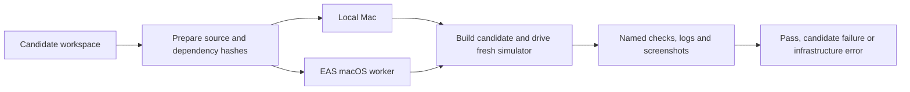

# Evaluation quality and the native app lane

For a small first run, costs and the redesigned report, start with
[Run a small pilot and read the evidence](run-and-read-evaluations.md).

The repository now distinguishes three questions. Keep their scores separate:

| Measurement | What varies | Evidence | Current scope |
|---|---|---|---|
| Source review | Agent-written Expo source | Pinned judge, explicit binary criteria | 21 tasks: 9 adapted API exercises, 12 field bug reports; three new tasks await judge calibration |
| Native UI, experimental | The submitted Expo app | Release build, native interactions, accessibility snapshots, screenshots | 3 iOS repair tasks |
| Device use | Model and device driver | Fixed SwiftUI app state and ordered UI-event journal | 7 simulator tasks |

The external result import bridge has been removed. Exact reference matching
remains a plumbing smoke check, separate from capability measurements.

## What changed

Source review now traces a behavior from its event handler to the displayed
result. The image-picker rubric includes successful selection updating the
preview; the route-parameter rubric includes rendering both received values.
The protected-routes prompt explicitly asks for the API its rubric requires.
Picker selectors, controls and added criteria are maintained directly in the task.

Calibration no longer treats a deterministic no-op guard as evidence that the
judge recognizes broken code. Every source task has a commented baseline that
changes bytes without fixing the behavior. The real judge must reject specific
criterion IDs from `tests/requirements/calibration.json`. A distractor must fail
the behavior it deliberately breaks; an unrelated low score is insufficient.
Every reference criterion must pass, including an alternative correct picker
implementation. Missing, duplicated or inconsistent criterion results fail
calibration. Ten tasks currently have explicit distractors; eight imported
tasks still need their own realistic wrong fixes.

The vision target is randomized per fresh app installation and the layout is
saved with the evidence. Wrong taps count across the whole trial, matching the
prompt. Trusted setup removes its copied golden-app source before agent work.
The dial task is labeled exact-value adjustment because its stepper buttons can
reach the answer. `jobs/simbench/unguided.yaml` names its condition explicitly:
installed tools are still available, while driver instructions are omitted.

Host Claude and Muse candidate commands use a combined macOS seatbelt profile
that denies ordinary file reads of evaluator tests, references, run outputs,
and app-state containers for the owned simbench device. Verification retains
access. This is a local development boundary; shared host services, credentials,
other checkouts and network access are not a hardened isolation model. Other
agent integrations must provide their own equivalent separation.

## Evaluate the actual submitted Expo app

The native lane assembles a pinned Expo fixture around the submitted `App.tsx`
and its supporting source. It builds **that candidate** as an iOS Release app,
installs it on a newly created simulator, then drives the native UI. It does not
substitute a fixed golden app for the candidate.



| Task | Native checks |
|---|---|
| `feedback-04-modal-editor-touch-freeze` | Three save/cancel cycles, saved text in the feed, canceled text discarded, another card still opens |
| `feedback-05-slider-relative-recenter` | Four positive/negative endpoint drags, physical thumb recenters, total accumulates beyond one nudge, center release is neutral |
| `sdk-04-image-picker-canceled-assets-guard` | Two canceled system-picker visits remain empty, then selecting a seeded photo renders a preview |

Each task's existing `testID` values are part of its public interaction contract.
Equivalent implementations are permitted. Tests inspect native slider values
and UI behavior; rendered source constants do not stand in for device evidence.
The picker preview check establishes that the image view appears. It is not a
pixel-level proof of the selected image's contents; the source rubric separately
requires that the actual selected URI reaches the Image.

Two checked-in dependency templates live under `mobile/templates/`: SDK 54 for
the slider, SDK 56 for the modal and picker. They contain exact package versions,
npm lockfiles, the Expo entry point/configuration, and a deterministic photo.
React 19.2.3 replaces incompatible 19.2.0 pins in the SDK 56 field fixtures.
`npm ci` installs the lock, Expo prebuild generates iOS, CocoaPods resolves native
dependencies, and Xcode produces the Release simulator app. The actual
`Podfile.lock`, tool versions, runtime and executable/JS hashes are retained.
Native dependencies are recorded after resolution; CocoaPods is not yet
replayed from a checked-in per-profile lock.

These are constrained code repair tasks. Dependency replacements, native app
configuration changes, arbitrary external apps, Android and Expo Go execution
are not supported by these three profiles. The instructions state the pinned
runtime contract. See Expo's [native generation documentation](https://docs.expo.dev/workflow/continuous-native-generation/)
for how prebuild derives the native project.

### Prepare locally without running anything

Preparation needs Python/uv; it does not need Xcode, an Expo token or a model key:

```sh
uv sync --dev
uv run expo-mobile-eval prepare \
  --task feedback-04-modal-editor-touch-freeze \
  --candidate /absolute/path/to/completed-app-workspace \
  --output .context/prepared-modal
```

Supply the complete candidate workspace, not just the file that changed. Output
must be a new directory outside the candidate. Preparation copies submitted
source/assets, omits hidden environment files and installed/generated folders,
checks dependency declarations and binds source/template/scenario hashes in
`input.json`. It rejects symlinked source. It is not a secret scanner for content
hard-coded into ordinary source files.

### Calibrate before evaluating models

The following commands **do** build apps and start simulators. They have not
been run for this revision. They need macOS, Xcode with an iPhone 17-compatible
iOS runtime, Node 24, npm, CocoaPods, uv and `agent-device@0.19.3`. The initial
system-picker scenario expects an English simulator locale. Set
`SIMBENCH_RUNTIME` to pin the installed iOS version; otherwise the newest
available runtime is chosen and recorded.

```sh
uv run expo-mobile-calibrate \
  --task feedback-04-modal-editor-touch-freeze \
  --attempts 3 --output runs/native-modal-calibration
```

Repeat for the slider and picker task names above. A baseline must build and
fail a native UI assertion. A build error or missing tool cannot establish the
negative control. References must pass every named check. The picker also tests
an alternative correct implementation and a discarded-URI distractor; the
slider tests its remount distractor. The timer-based modal distractor remains
a source-contract negative control because its runtime failure is intermittent.

Each trial retains logs, snapshots, screenshots, locks and input/build hashes.
`calibration.json` records every required condition and repetition and cannot
report success for a partial calibration. A baseline that succeeds means the
scenario does not reproduce the reported issue on that runtime: investigate the
task/runtime pairing before interpreting model scores.

Once calibrated, run a prepared candidate or generate-and-verify through Harbor:

```sh
uv run expo-mobile-eval execute --output .context/prepared-modal

# Opt-in model job: three attempts on each of the three native tasks.
uv run harbor run -c jobs/native/repairs.yaml \
  --job-name mobile-native-v2 --yes
```

`run` combines preparation and execution. Native checks are all-or-nothing:
`reward=1` only if the build and every expected scenario check pass. Candidate
build/behavior failures have `mobile_runner_ok=1`; toolchain, driver transport,
timeout or cleanup failures have `mobile_runner_ok=0`. Candidate build errors
are diagnostic rather than a calibrated negative control. CLI exit codes are
0/pass, 1/candidate failure, 2/infrastructure failure. Native calibration must
establish that the fixed harness itself builds before using that distinction.

Harbor's `EXPO_EVAL_VERIFIER_MODE=mobile` invokes this same runner for supported
tasks. The example job gives the verifier a 3,300-second budget and serializes
trials. The standalone command writes `reward.json` and `details.json`;
`expo-eval-report` reads these directly as well as Harbor trials and native
calibration directories. Use the Harbor job to retain coding-agent usage,
transcripts and finished-run history.

### Run the same candidate on an EAS worker

The controller reads `.env.local` with `EXPO_TOKEN` and `EAS_EVAL_PROJECT_ID`, as
described in [Running mobile evaluations](running-mobile-evals.md). Preparation
can also run on a machine without a local Mac toolchain:

```sh
uv run expo-eas-eval prepare \
  --task feedback-04-modal-editor-touch-freeze \
  --candidate /absolute/path/to/completed-app-workspace \
  --output .context/eas-modal

# Starts paid cloud compute; preparation above does not.
uv run expo-eas-eval run \
  --project .context/eas-modal --output runs/eas-modal
```

This uploads the prepared candidate, locked evaluator code and selected task.
One candidate trial runs per shard. Local and EAS execution call the same
native scenarios. The collector validates the source/shard and submission
identity and rejects a claimed pass without the complete expected checks.
Evidence is under `evidence/native-eval/`; `summary.json` reports the outcome.
The workflow currently evaluates an already-written candidate; it does not
start a cloud coding agent. No Expo Sandbox MCP or E2B is involved. A separately
leased `eas simulator:*` session remains a different, unimplemented transport.

## App ownership and reproducibility

Keep the small task fixtures, reference fixes, verifiers and dependency locks
in this repository. That makes reviews and clean-checkout reproduction possible.
A bare GitHub link is not a reproducible app input. Larger third-party apps can
stay in their own repositories, but a future importer must bind an immutable
commit, license, build command, dependency locks, seed/reset procedure and
expected artifact hash. That arbitrary-repository importer is not implemented.

`suites/mobile-v2.json` freezes all 28 task definitions and the evaluator/toolchain
files. Codegen jobs now list their 18 members explicitly; adding a directory
does not silently change an existing comparison.
The paywall, amount-column and authentication-field definitions are outside those cohorts pending judge calibration;
its offline Node contract checks validate the authored controls, not candidate
models or native UI. See [the feedback review](feedback-review.md). Inspect or
refresh the lock with:

```sh
uv run expo-eval-suite check
# After reviewing a deliberate task/evaluator change:
uv run expo-eval-suite lock
```

Local Harbor trials reject stale locks and record a non-secret experiment hash:
suite, task cohort, model configuration, preface, tool permissions, judge/mode
and selected budgets. Simbench also includes the resolved runtime/device type.
Reports separate these experiments and backends. They show mean reward among
valid results, completion across recorded attempts and infrastructure errors.
Completion is not `pass@k`: it is successful attempts divided by recorded
attempts. Missing/unstarted trials are not included; check job completeness
before comparing scores. Host CLI versions, mutable model aliases and implicit
personal settings remain reproducibility gaps. Old runs without identity
records remain separate from versioned results.

## Validation and remaining coverage

This revision was checked with unit tests, static task/lock checks and CLI/schema
validation. No model sweep, native app build, simulator evaluation or EAS job
was run during these improvements. The new native profiles explicitly retain
`requires-native-calibration`. Updated source judges and randomized simbench
fixtures also require fresh calibration; earlier run numbers do not certify
the revised suite.

Next useful coverage is Android keyboard/back behavior, cold-start navigation
and deep links, notifications lifecycle, file persistence across relaunch, and
data-dependent user journeys. The existing four-step shift flow validates order
across screens; it does not make later inputs depend on earlier outputs. The
three-scene task is labeled source-review/knowledge-only, since no runtime
measurement presently demonstrates its rendering or performance claims.
